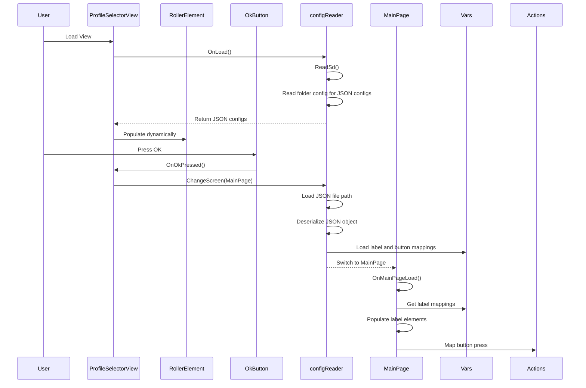

# Bluetooth Macrokeys ESP32 JC2432W28C Guition implementation

## Features 
 - EEZ studio -> LVGl mative cpp implementation

 - BleKeyboard library

 - Loads json profiles from Sd card by reading macrokeys/config folder

 - Two Tab 3x2 Custom buttons, button box

Todo: deserialise json and map from config

## Flow diagram (on going)
